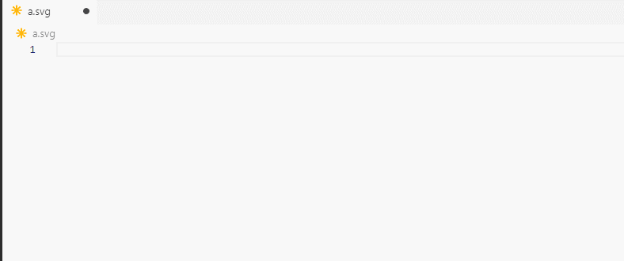
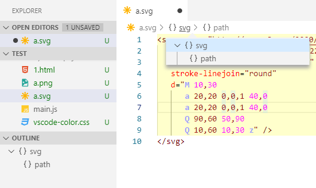
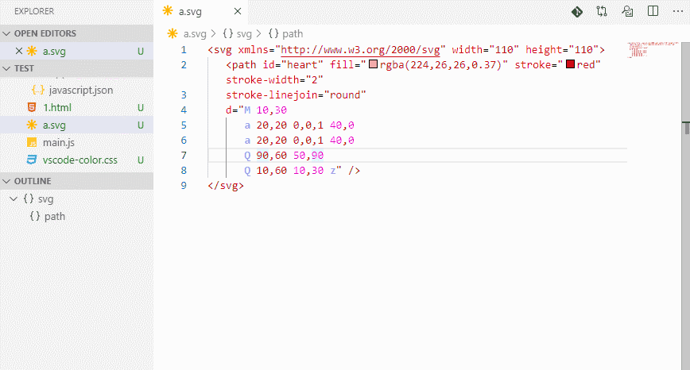
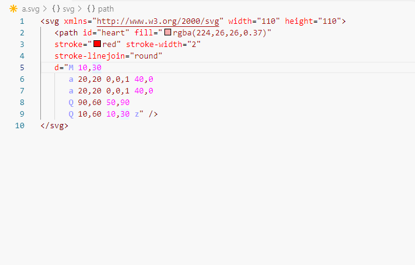
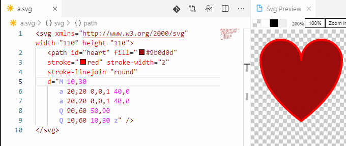

# svg

A Powerful SVG Language Support Extension.
Almost all the features you need to handle SVG.

## Features

### SVG Full Auto Completion.

> Tip: All Completion list is context, will only show enable items.

### Document Symbol tree.

### SVG Live Preview and Export PNG

### MDN Reference for fast learn

> Tip: Configure Trusted Domains add MDN to it get more fast action.

### Fast Color Picker

### Rename Tag Name or Id Reference.

Cursor in Tag Name or Id Attribute or url(#id) Hit F2(Windows) Key, Rename it!

### In Id Reference Click Goto id="" element.

Hot Ctrl Key and Move mouse to a url(#id), That it!

### SVG Format Support
Formatting support using SVGO, which can prettify SVGs and sort tag attributes.
SVGO works as a group of plugins that can be activated or desactivated (which is default for most in this extension).
Information on the plugins can be found [here](https://www.npmjs.com/package/svgo).

### Minify SVG with SVGO

Open the **Command Palette** (`⇧⌘P` on Mac and `Ctrl+Shift+P` on Win/Linux) and run `Minify SVG`. This will reduce the filesize significantly by removing all unnecessary code from the image.

## Contributors

* [Laurent Tréguier](https://github.com/LaurentTreguier) for sharing SVG formatting features
* [Björn Ganslandt](https://github.com/Ansimorph) for sharing Minify SVG features
* [Amelia Bellamy-Royds](https://github.com/AmeliaBR) for Add the xmlns and xmlns:xlink attributes
* [Evan Demaris](https://github.com/evandemaris)
* [Trevor Burnham](https://github.com/TrevorBurnham)
* [Philipp Kief](https://github.com/PKief)

## Known Issues

SVG Version 2.0 is not included.

## Update History

### 1.1.3
* Fix a format bug from `SVGO`

### 1.1.2
* Fix previewer will not auto take focus.

### 1.1.1
* Fix minifySvg menu show in all editor

### 1.1.0
* Add path data auto tip feature

### 1.0.5
* Fix `pathDataHighlight` does not work after VS Code restarting

### 1.0.3 & 1.0.4
* Fix in `Untitled` file, some command no working.

### 1.0.2
* Add `svg.pathDataHighlight` configuration you can disable path data highlight feature
* Fix release webpack bug `minifySvg` command no working

### 1.0.1
* Fix Preview toolbar styles bug
* Add `svg.preview.autoShow` configuration let preview auto show when a SVG document open

### 1.0.0
* All Rewrite base langauge service protocol
* Add MDN doc link to hover tip and completion documentation
* Add Export PNG in perview view
* Remove Unnecessary configuration

### 0.1.6
* A small amount of BUG fixes.

### 0.1.5
* Pretty SVG now set indent use editor tabSize setting.
* Update all package for Security.

### 0.1.4
* FIX Preview Zoom Reset.

### 0.1.3
* Add Zoom to Preview.
* Add Background Switch to Preview.

### 0.1.2
* Add 'xlink:href' attribute.

### 0.1.1
* Fix The contents of the document are emptied when the format fails.

### 0.1.0
* Add `Pretty SVG` command.
* Add Experimental Setting `svg.disableFormatOnSave`.

### 0.0.9
* Add `Minify SVG` command.

### 0.0.8
* Change Format SVGO Options.

### 0.0.7
* Fix some debug time warning.
* Change Preview use 'Transparent' background.

### 0.0.6
* Add Formatting support using SVGO.

### 0.0.5
* Add url(#id) Definition Provider.

### 0.0.4
* Add New Rename Provider.

### 0.0.3
* New Hover Info Support.
* Improve Completion list in paint show color keywords.
* Improve Completion list work like snipple (For base sharp). Required vscode >=1.8 .
* The `svg.completion.showDeprecated` Configuration item is actived, will not show deprecated item in completion list by default(`false`).

### 0.0.2

* Improve Preview.
* Improve Id Symbol show `[tag]#[id]` and fix a bug.

### 0.0.1

* Initial release.

-----------------------------------------------------------------------------------------------------------
## For more information

* [MDN SVG Reference](https://developer.mozilla.org/en-US/docs/Web/SVG)

**Enjoy!**

## Donations
Welcome [Support this project](Donations.md).